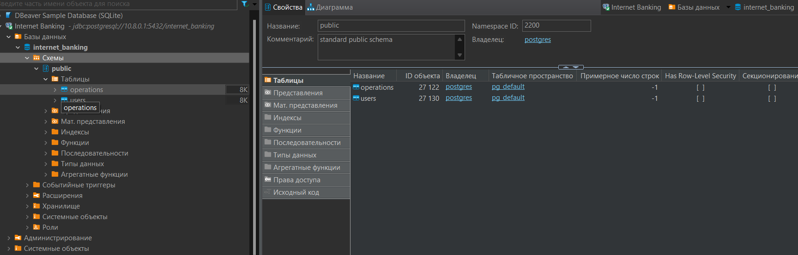

# Internet Banking Application

This application provides a simple RESTful API to manage users and their bank accounts.

## Features

- Retrieve user information by user ID.
- Retrieve the balance of a specific user by user ID.
- Deposit money into a user's account by user ID.
- Withdraw money from a user's account by user ID.
- Retrieve a list of banking operations for a user within a specified date range.

## Endpoints

- `GET /users/{id}`: Retrieve user information by user ID.
- `GET /users/{id}/balance`: Retrieve the balance of a user by user ID.
- `PUT /users/{id}/put`: Deposit money into a user's account.
- `PUT /users/{id}/take`: Withdraw money from a user's account.
- `GET /users/{id}/operations`: Retrieve a list of operations for a user, optionally within a specified date range.

## Error Handling

- Handles `UserNotFoundException` by returning a 404 status code along with the error message.

## Technologies

- Spring Boot
- Spring Web

## Database Structure

Refer to the provided database structure diagram to understand the relational model supporting this application.

